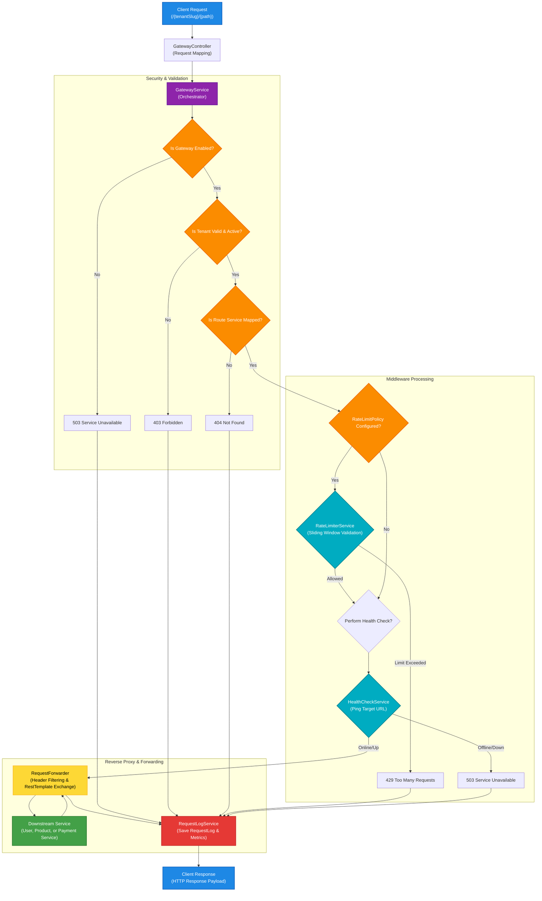
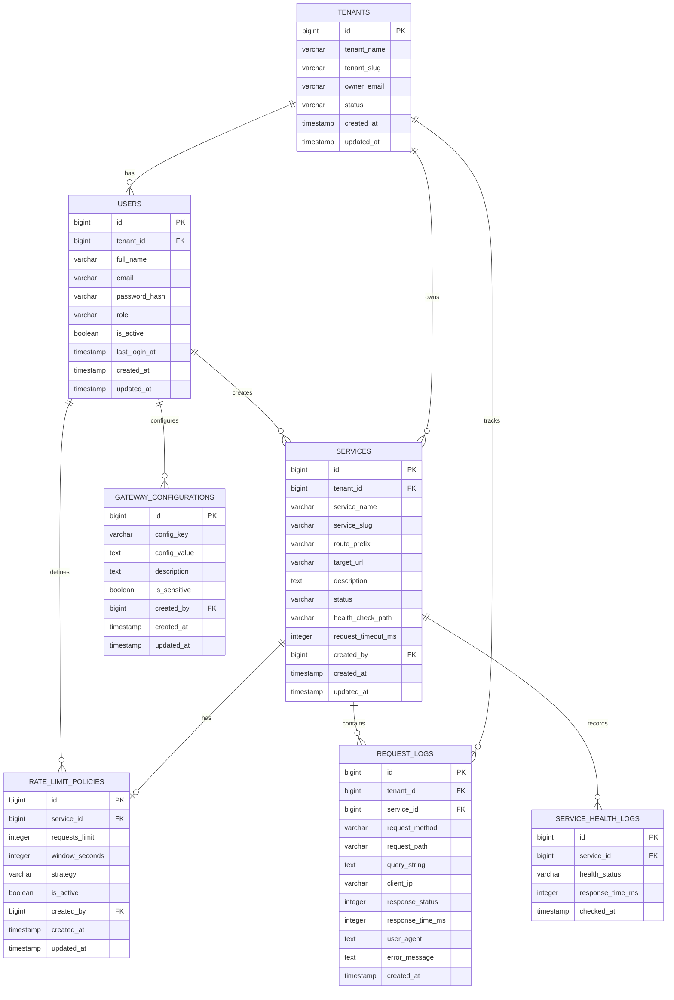

# RFlow 🚀

RFlow is a lightweight, high-performance API Gateway and traffic controller built with **Java Spring Boot 3.x** and **PostgreSQL**. Acting as a dynamic reverse proxy and request broker, RFlow manages client traffic to downstream microservices. It features multi-tenant routing, sliding-window rate limiting, active and dynamic health monitoring, and detailed database logging. The entire gateway state, configurations, health records, and traffic logs can be monitored and managed in real time via a modern, responsive **React (v19) + Vite** Admin Dashboard.

[](https://adoptium.net/)
[](https://spring.io/projects/spring-boot)
[](https://react.dev/)
[](https://www.postgresql.org/)
[](https://www.docker.com/)
[]()
[]()

---

## 🌐 Live Demo & Deployments

The project is fully deployed and active:

| Component | Target URL | Platform |
| :--- | :--- | :--- |
| **Admin Dashboard 📊** | [rflow-dashboard.vercel.app](https://rflow-dashboard.vercel.app/) | Vercel |
| **API Gateway 🚀** | [rflow-dopn.onrender.com](https://rflow-dopn.onrender.com/) | Render |
| **Mock User Service 👤** | [user-service-3nxn.onrender.com](https://user-service-3nxn.onrender.com/) | Render |
| **Mock Product Service 📦** | [product-service-tk6p.onrender.com](https://product-service-tk6p.onrender.com/) | Render |
| **Mock Payment Service 💳** | [payment-service-nuu7.onrender.com](https://payment-service-nuu7.onrender.com/) | Render |

---

## Why RFlow?

Modern backend microservice architectures require a single, robust entry point to handle security, rate limiting, logging, and routing. Without a gateway, clients have to directly interact with multiple service hosts, causing CORS problems, security leaks, and routing complexities. 

RFlow was designed to showcase:
- How to implement a robust multi-tenant gateway that isolates configurations, rate limit policies, and client scopes using dynamic database queries.
- How to structure client request pipelines to inspect, validate, filter, and forward HTTP headers and body payloads downstream.
- How to build a modern dashboard that interfaces with gateway configurations to monitor health and inspect raw gateway request logs.

---

## Features ✨

- 🔀 **Dynamic API Routing & Proxying**: Routes incoming requests prefixed with `/{tenantSlug}/{route_prefix}` dynamically using database configurations.
- 🏢 **Multi-Tenant Separation**: Dynamic isolation using tenant-based IDs (`tenant_id`) ensuring separate users, route services, policies, and logs.
- ⏳ **Sliding-Window Rate Limiting**: In-memory request tracking using a thread-safe windowed timestamp mapping.
- 🛡️ **Flexible Limit Strategies**: Apply limit tracking based on client **IP address**, HTTP header **API Keys**, or auth-based **User IDs**.
- 📡 **Active Downstream Health Monitoring**: Live checks that query target paths (e.g., `/health`) to verify backend service status before proxying.
- 📜 **Audit & Analytical Logging**: Logs client details, headers, query variables, response times, and status results into SQL for diagnostics.
- 📊 **Developer Admin Console**: A sleek dashboard offering graph summaries, configuration forms, an API endpoint runner, and interactive logs.
- 📦 **Docker Containerization**: Gateway and microservices packageable into Docker containers for isolated containerized environments.

---

## High-Level Request Pipeline

When a client sends an HTTP request, the request flows through the validation, rate-limiting, health check, and forwarding filters in the gateway before returning the downstream service's response.



---

## Database ERD & Architecture

RFlow handles tenant configuration, users, routes, and logs using relational PostgreSQL constraints. The database model is organized around the primary `tenants` table.



### Table Details
1. **[tenants](file:///d:/Code_PlayGround/rflow/api-gateway/src/main/resources/schema.sql#L11-L20)**: Holds the tenant organization name, status (`ACTIVE`, `DISABLED`, `SUSPENDED`), and unique identifier (slug) used for path-based routing.
2. **[users](file:///d:/Code_PlayGround/rflow/api-gateway/src/main/resources/schema.sql#L22-L36)**: Stores user credentials and administrator roles (`SUPER_ADMIN`, `TENANT_ADMIN`, `DEVELOPER`) belonging to specific tenants.
3. **[services](file:///d:/Code_PlayGround/rflow/api-gateway/src/main/resources/schema.sql#L38-L56)**: Maps the prefix paths (e.g. `/api/users`) to target physical addresses (e.g. `http://localhost:8081`) for a given tenant.
4. **[rate_limit_policies](file:///d:/Code_PlayGround/rflow/api-gateway/src/main/resources/schema.sql#L58-L69)**: Holds requests count constraints, seconds duration window, and strategy definitions for matching backend services.
5. **[request_logs](file:///d:/Code_PlayGround/rflow/api-gateway/src/main/resources/schema.sql#L71-L84)**: Keeps records of routed requests, execution durations, response statuses, client IPs, user agents, and errors.
6. **[service_health_logs](file:///d:/Code_PlayGround/rflow/api-gateway/src/main/resources/schema.sql#L86-L93)**: Captures health test history, mapping performance times, and statuses for each service target.
7. **[gateway_configurations](file:///d:/Code_PlayGround/rflow/api-gateway/src/main/resources/schema.sql#L95-L104)**: Manages global gateway parameters dynamically, such as enabling or disabling the gateway service instantly.

---

## Project Structure 📁

The workspace is organized into three main components: the API Gateway backend, mock microservices, and the React frontend dashboard.

```text
rflow/
├── api-gateway/                      # Spring Boot API Gateway application
│   ├── src/main/java/com/rflow/gateway/
│   │   ├── config/                   # Global beans, exception handlers & CORS
│   │   ├── controller/               # REST Endpoints for routing & administration
│   │   ├── dto/                      # Data Transfer Objects for JSON request/response
│   │   ├── model/                    # JPA Entities matching the database tables
│   │   ├── repository/               # Spring Data JPA repositories
│   │   └── service/                  # Core Business Services (Routing, Rate Limiting, Forwarding)
│   ├── src/main/resources/
│   │   ├── application.yaml          # Gateway configuration options
│   │   ├── schema.sql                # PostgreSQL table definitions
│   │   └── data.sql                  # Seed database records
│   ├── Dockerfile                    # Containerization instructions
│   └── pom.xml                       # Maven build descriptor
│
├── frontend/                         # React Admin Dashboard
│   ├── src/                          # Dashboard pages, forms, styles & components
│   ├── package.json                  # NPM modules & build commands
│   └── vite.config.js                # Vite build configurator
│
├── mock-services/                    # Downstream services representing backend targets
│   ├── user-service/                 # Mock user registration service (Port 8081)
│   ├── product-service/              # Mock catalog & product service (Port 8082)
│   └── payment-service/              # Mock transaction payment service (Port 8083)
│
├── LICENSE                           # Open source MIT license file
└── README.md                         # Project documentation (this file)
```

---

## Core Gateway Services

Detailed code descriptions of the primary gateway orchestration layers:

### 1. Request Dispatcher
The [GatewayController](file:///d:/Code_PlayGround/rflow/api-gateway/src/main/java/com/rflow/gateway/controller/GatewayController.java) receives all traffic directed at `/{tenant}/**`. It captures the path variables and request bodies and delegates handling directly to the core [GatewayService](file:///d:/Code_PlayGround/rflow/api-gateway/src/main/java/com/rflow/gateway/service/GatewayService.java).

```java
@RequestMapping("/{tenant}/**")
public ResponseEntity<?> handle(@PathVariable String tenant, HttpServletRequest request,
                                @RequestBody(required = false) String body) {
    return gatewayService.process(tenant, request, body);
}
```

### 2. Request Processing Pipeline
The [GatewayService](file:///d:/Code_PlayGround/rflow/api-gateway/src/main/java/com/rflow/gateway/service/GatewayService.java) controls the execution pipeline:
- Validates the target tenant exists and has an `ACTIVE` status using the [TenantService](file:///d:/Code_PlayGround/rflow/api-gateway/src/main/java/com/rflow/gateway/service/TenantService.java).
- Performs routing resolution via the [RouteService](file:///d:/Code_PlayGround/rflow/api-gateway/src/main/java/com/rflow/gateway/service/RouteService.java) to find the correct `BackendService`.
- Triggers sliding window validation via the [RateLimiterService](file:///d:/Code_PlayGround/rflow/api-gateway/src/main/java/com/rflow/gateway/service/RateLimiterService.java) based on the matching `RateLimitPolicy`.
- Validates target status using the [HealthCheckService](file:///d:/Code_PlayGround/rflow/api-gateway/src/main/java/com/rflow/gateway/service/HealthCheckService.java).
- Executes the proxy dispatch using the [RequestForwarder](file:///d:/Code_PlayGround/rflow/api-gateway/src/main/java/com/rflow/gateway/service/RequestForwarder.java) and audits the results via the [RequestLogService](file:///d:/Code_PlayGround/rflow/api-gateway/src/main/java/com/rflow/gateway/service/RequestLogService.java).

### 3. Proxy Routing & Request Forwarding
The [RequestForwarder](file:///d:/Code_PlayGround/rflow/api-gateway/src/main/java/com/rflow/gateway/service/RequestForwarder.java) extracts request attributes, filters out client host, origin, and referer headers, builds standard user-agent configurations, and executes the HTTP call downstream using `RestTemplate` exchange before returning clean responses back to the client.

### 4. Sliding-Window Rate Limiter
The [RateLimiterService](file:///d:/Code_PlayGround/rflow/api-gateway/src/main/java/com/rflow/gateway/service/RateLimiterService.java) implements a thread-safe sliding window rate-limiting algorithm using `ConcurrentHashMap`. It keeps timestamps of requests per key and evicts entries older than the configured window.

```java
public boolean allowRequest(String key, int maxRequests, int windowSeconds) {
    long now = System.currentTimeMillis();
    requestTracker.putIfAbsent(key, new ArrayList<>());
    List<Long> requests = requestTracker.get(key);
    requests.removeIf(time -> time < now - (windowSeconds * 1000L));
    if (requests.size() >= maxRequests) {
        return false;
    }
    requests.add(now);
    return true;
}
```

RFlow supports three rate-limiting keys based on the service's `strategy` configuration:
- **IP Strategy**: Tracks rate based on client remote address.
- **API Key Strategy**: Extracts key token from the HTTP Header `X-API-Key`.
- **User Strategy**: Identifies client using the HTTP headers `X-User-Id` or `Authorization`.

---

## Running the Project ▶️

Follow the steps below to build, configure, and launch RFlow.

### Prerequisites
- **Java SE Development Kit (JDK 21)**
- **Node.js (v18+)** & **npm**
- **PostgreSQL Database Server**
- **Maven** (configured locally, or use the Maven Wrapper `./mvnw` inside the directories)

---

### Step 1: Clone the Repository
```bash
git clone https://github.com/Raj-Patel7807/rflow.git
cd rflow
```

---

### Step 2: Configure PostgreSQL Database
1. Create a database in PostgreSQL named `rflow`:
   ```sql
   CREATE DATABASE rflow;
   ```
2. Navigate to [api-gateway/src/main/resources/](file:///d:/Code_PlayGround/rflow/api-gateway/src/main/resources/) and copy `application-example.yml` to `application.yaml`:
   ```bash
   cp api-gateway/src/main/resources/application-example.yml api-gateway/src/main/resources/application.yaml
   ```
3. Edit the PostgreSQL connections inside the newly created `application.yaml` file to match your username and password:
   ```yaml
   spring:
     datasource:
       url: jdbc:postgresql://localhost:5432/rflow
       username: your_postgresql_user
       password: your_postgresql_password
   ```

---

### Step 3: Run the API Gateway Backend
**Option A: Local Development via Maven Wrapper**
From the repository root directory:
```bash
cd api-gateway
./mvnw clean spring-boot:run
```
The gateway will start up, automatically execute [schema.sql](file:///d:/Code_PlayGround/rflow/api-gateway/src/main/resources/schema.sql) to create the schema structures, and insert seed configuration records from [data.sql](file:///d:/Code_PlayGround/rflow/api-gateway/src/main/resources/data.sql).

**Option B: Docker Container Deployment**
Ensure you have Docker running locally, then:
```bash
cd api-gateway
docker build -t rflow-gateway .
docker run -p 8080:8080 --name rflow-gateway-instance rflow-gateway
```

---

### Step 4: Run the Mock Microservices
Open three separate terminal sessions to start the mock downstream microservices. They run on separate ports using local H2 database scripts.

- **User Service (Port 8081)**
  ```bash
  cd mock-services/user-service
  ./mvnw spring-boot:run
  ```
- **Product Service (Port 8082)**
  ```bash
  cd mock-services/product-service
  ./mvnw spring-boot:run
  ```
- **Payment Service (Port 8083)**
  ```bash
  cd mock-services/payment-service
  ./mvnw spring-boot:run
  ```

---

### Step 5: Start the React Admin Dashboard
Navigate to the frontend folder, set up environment variables, install dependencies, and run the Vite development server:
```bash
cd frontend
cp .env.example .env
npm install
npm run dev
```
The browser dashboard will run at [http://localhost:5173](http://localhost:5173). Ensure `VITE_API_URL` in `frontend/.env` matches the running gateway address (`http://localhost:8080`).

---

## Sample API Requests & Logging

Below is a walkthrough of how to request resources via the gateway and how the gateway handles routing, logging, and rate limiting. You can execute these requests against your **Local Instance** or the **Live Deployed Endpoint**.

### 1. Dynamic Routing Request
By calling the gateway route prefixed with the tenant slug (`tenant-a`), the gateway resolves the prefix path (`/users`) and proxies it downstream to the User Service.

**Request Endpoint:**
* **Local:** `GET http://localhost:8080/tenant-a/api/users`
* **Production:** `GET https://rflow-dopn.onrender.com/tenant-a/api/users`

**Response:**
```json
[
  {
    "id": 1,
    "name": "John Doe",
    "email": "john.doe@example.com"
  },
  {
    "id": 2,
    "name": "Jane Smith",
    "email": "jane.smith@example.com"
  }
]
```

---

### 2. Rate Limited Request
If a service has a policy limiting requests (e.g., **3 requests per 10 seconds**) and the limit is exceeded, subsequent requests will receive a `429 Too Many Requests` status code.

**Request Endpoint:**
* **Local:** `GET http://localhost:8080/tenant-a/api/users`
* **Production:** `GET https://rflow-dopn.onrender.com/tenant-a/api/users`

**Response:**
```http
HTTP/1.1 429 Too Many Requests
Content-Type: text/plain

Too Many Requests
```

---

### 3. Service Outage/Health Failure
If the downstream target service is shut down or goes offline, the health checker detects it and returns a `503 Service Unavailable` status code to prevent routing failures.

**Request Endpoint:**
* **Local:** `GET http://localhost:8080/tenant-a/api/payments`
* **Production:** `GET https://rflow-dopn.onrender.com/tenant-a/api/payments`

**Response:**
```http
HTTP/1.1 503 Service Unavailable
Content-Type: text/plain

Service Unavailable
```

---

## Future Roadmap & Enhancements 🚧

- [ ] **JWT Token Authentication & Verification**: Validate JSON Web Tokens directly at the gateway entrypoint.
- [ ] **Distributed Caching with Redis**: Transition from in-memory sliding-window trackers to Redis clusters to share rate limits across multiple gateway instances.
- [ ] **Load Balancing Configurations**: Add Round Robin and Least Connections scheduling policies for routing to multiple downstream hosts.
- [ ] **Service Registry & Discovery**: Integrate Spring Cloud Eureka or Consul to resolve target microservice hosts dynamically.
- [ ] **Orchestrated Docker Compose**: A single `docker-compose.yml` to spin up PostgreSQL, the gateway, all mock services, and the dashboard with one command.

---

## License

This project is licensed under the MIT License. See [LICENSE](file:///d:/Code_PlayGround/rflow/LICENSE) for more details.

---

Built with ❤️ by **Raj Patel** to explore distributed systems architecture, microservices networking, API Gateway design patterns, and database multi-tenancy.
